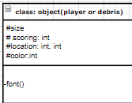
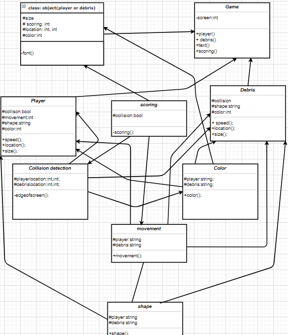

|   #   | File                             | Description                                                    |
| :---: | -------------------------------- | -------------------------------------------------------------- |
|   PO1   | [Banner](Banner)| this is displaying the banner for this assignment                             |
|   PO1   | [ScreenShot.png](MainClasses.PNG.png)| this is an outline of the whole program                  |
|   PO1   | [GameClass.png](gameclass.png)| this is the outline of the game class                           |
|   PO1   | [maintext.png](maintext.png)| this is the main text class                                       |
|   PO1   | [colidingclass.png](colidingclass.png)| this is the class for collision detection               |
|   PO1   | [color.png](color.png)| this is determining the color schematics                                |
|   PO1   | [movement.png](movement.png)| this determines the movement                                      |
|   PO1   | [debirs.png](debris.png)| this characterizes the debris                                         |
|   PO1   | [PlayerClass.png](playerclass.png)| this is the main player class                               |
|   PO1   | [scoring.png](scoring.png)| this determines the scoring aspects                                 |

# Assignment 7 - Designing your Game
Due: 02-16-2021 (Tuesday @ 9:30 p.m.)
Overview
When designing classes with the OOP mindset, you should follow a few principles to keep you out of trouble. I will list a few to help you when designing your poker game.

##  CLASSES FOR GAME

## Player

-Has a Shape

-Has a Size

-Has a Color

-Has a Speed

-Has a Location (could change)

-Can move in any direction using keys

-Has a score

-Can collide with other "objects"

##### Debris

-Has a Shape

-Has a Size

-Has a Color

-Has a Speed

-Has a Location (could change)

-Can move in any direction

-Can collide with other "objects"

### Scoring

-When a Player comes collides with Debris score is negatively effected.

-When a piece of Debris leaves game screen (on the left), score is positively effected.

## Text

-Has a Font (can change)

-Has a Location

-Has a Color

-Has a Size

## Game

-Has player(s)

-Has score(s)

-Has debris(s) (yes "debris" can be plural but it doesn't make the point)

# MAIN DIAGRAM

