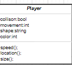
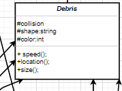
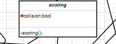
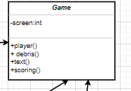

|   #   | File                             | Description                                                    |
| :---: | -------------------------------- | -------------------------------------------------------------- |
|   PO1   | [Banner](Banner)| this is displaying the banner for this assignment                             |
|   PO1   | [ScreenShot.png](MainClasses.PNG.png)| this is an outline of the whole program                  |
|   PO1   | [GameClass.png](gameclass.png)| this is the outline of the game class                           |
|   PO1   | [maintext.png](maintext.png)| this is the main text class                                       |
|   PO1   | [colidingclass.png](colidingclass.png)| this is the class for collision detection               |
|   PO1   | [color.png](color.png)| this is determining the color schematics                                |
|   PO1   | [movement.png](movement.png)| this determines the movement                                      |
|   PO1   | [debirs.png](debris.png)| this characterizes the debris                                         |
|   PO1   | [PlayerClass.png](playerclass.png)| this is the main player class                               |
|   PO1   | [scoring.png](scoring.png)| this determines the scoring aspects                                 |

# Assignment 7 - Designing your Game
Due: 02-16-2021 (Tuesday @ 9:30 p.m.)
Overview
When designing classes with the OOP mindset, you should follow a few principles to keep you out of trouble. I will list a few to help you when designing your poker game.

#### Dry (Don't Repeat Yourself)
Don't write duplicate code.
A class should do its own thing. If two classes are doing the same thing, to the same data, maybe it should be its own class entirely.
Similarly, if you have a block of code in more than two places consider making it a separate method.
Single Responsibility Principle (SRP)
A class should be written to handle one defined thing, and handle it well.
The definition of "one" is the question here.
Think along the lines of decoupling. For example when ClassA depends heavily on ClassB, the chances of ClassA being affected when ClassB is changed are high. We don't want this to happen.
#### Favor Composition over Inheritance
We haven't discussed inheritance yet, but still here are a couple of points to think about.
To favor composition over inheritance is a design principle that gives the design higher flexibility.
It is more natural to build classes out of various separate components rather than trying to find commonality between them in order to create an inheritance hierarchy.
Requirements / Attributes
When writing "requirements" for your classes (and we are following a very loose design process for now) you should think in the following terms:

The <thing> should provide <something> so we can do <this>.
They don't ALL have to fit this exactly, but each "requirement" or "attribute" should at least have a <subject> => <verb> approach.
Example:

A score (the <thing>) should know its value (the <something>) so it can be displayed (the <this>) on a game window.
A player (the <thing>) should know its location (the <something>) so it can be checked (the <this>) for collisions.
Without all the keywords embedded now:
A debris item should know its speed and direction so we can update its location.
A player should know its speed and direction so we can update its location.
What do we notice about a debris item and a player? Seems to be a lot of overlap! We can leverage that information in our design!

Lets look at some of the requirements for our game, and then think about designing it.

## Possible Classes

###### Player

Has a Shape
Has a Size
Has a Color
Has a Speed
Has a Location (could change)
Can move in any direction using keys
Has a score
Can collide with other "objects"
##### Debris

Has a Shape
Has a Size
Has a Color
Has a Speed
Has a Location (could change)
Can move in any direction
Can collide with other "objects"

### Scoring

When a Player comes collides with Debris score is negatively effected.
When a piece of Debris leaves game screen (on the left), score is positively effected.
Text
Has a Font (can change)
Has a Location
Has a Color
Has a Size

## Game

Has player(s)
Has score(s)
Has debris(s) (yes "debris" can be plural but it doesn't make the point)
