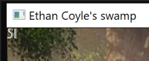

#### this is my projects folder containing all the links to my various projects

|   #    | Folder Link       | Assignment Description                          |
|------- |-------------------|-------------------------------------------------|
| [01](.P01) |  [P01](./P01) | [ Program for our first game code UML](./P01)   |
| [02](.main.cpp) |  [main Code](./main.cpp) | [ main program](./main.cpp)   |
| [03](.Banner) |  [Banner](./Banner) | [ Banner Page](./Banner)   |
| [04](.GameOverPicture.png) |  [GameOver Picture](./Gameplay/GameOverPicture.png) | [ screenshot of gameover](./P01)   |

## Collision Detection

#### Image used to track collision detection

#### 

-> for the collision detection i used the ogreshout that fires off from

-> the character and whenever it collides with the flying debris, then

-> the debris detects the interesction, one goes away, one point is added

## Player

#### Picture Texture of the player

#### 

-> the player starts the game by holding down the spacebar and in turn this 

-> fires off the ogreshout at the flying debris

-> upon collsion, it calls collision detection

-> the player is also able to move left,right,up down and

-> has a position and size

## Debris

#### 

-> the flying debris has a texture of the Donkey which position

-> is tracked whenever it moves across the screen

-> collision detection is recorded when player shout intersects with shout

-> the debris position starts from the right of the screen and is tracked

-> inside of the window frame if the allotted number is not on the screen, then 

-> another one comes in the window

## Scoring

#### Image of active score tally

#### 

-> this scoring is shown in the top left corner(position)

-> each time a collision detection is detected between

-> ogreshout and donkey debris, point is actively incremented by 1

-> the gameover sequence is preset to reach 50 points

-> scoreboard also has a set size and actively increments

## Font

#### [Fonts used](/Assignments/P01/Fonts)

-> created a link to style the font for gameover and the score

-> the font is named textfont.tff

-> they both have a size and poistion and the score is actively incremented 

-> each time the player creates collision

## Gameplay Pictures

#### 

-> this is a screenshot of the active game playing 

#### GameOver

#### 

-> this a screenshot of the gameover sequence once max points reached

-> if player hit escape button, exit out of the game

## additional add ons

#### added FOUR music files

[MUSIC FILES](/Assignments/P01/soundfiles)

-> Happy.ogg  - this is the background music that plays throughout the game

-> getout.ogg - this plays whenever the player hits the spacebar

-> youlose.ogg - This fires up whenever the max points are reached and game over

-> startup.ogg - this fires up shrek shouting what are you doing in my swamp 

#### added a BACKGROUND image

#### 
>

-> with this created a size and texture for the background 

-> with a preset image