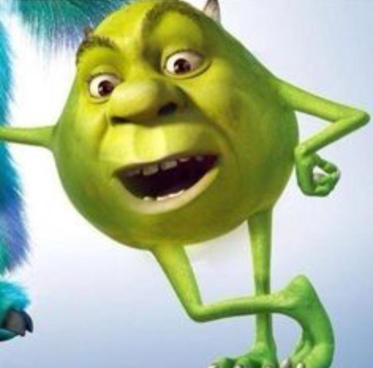
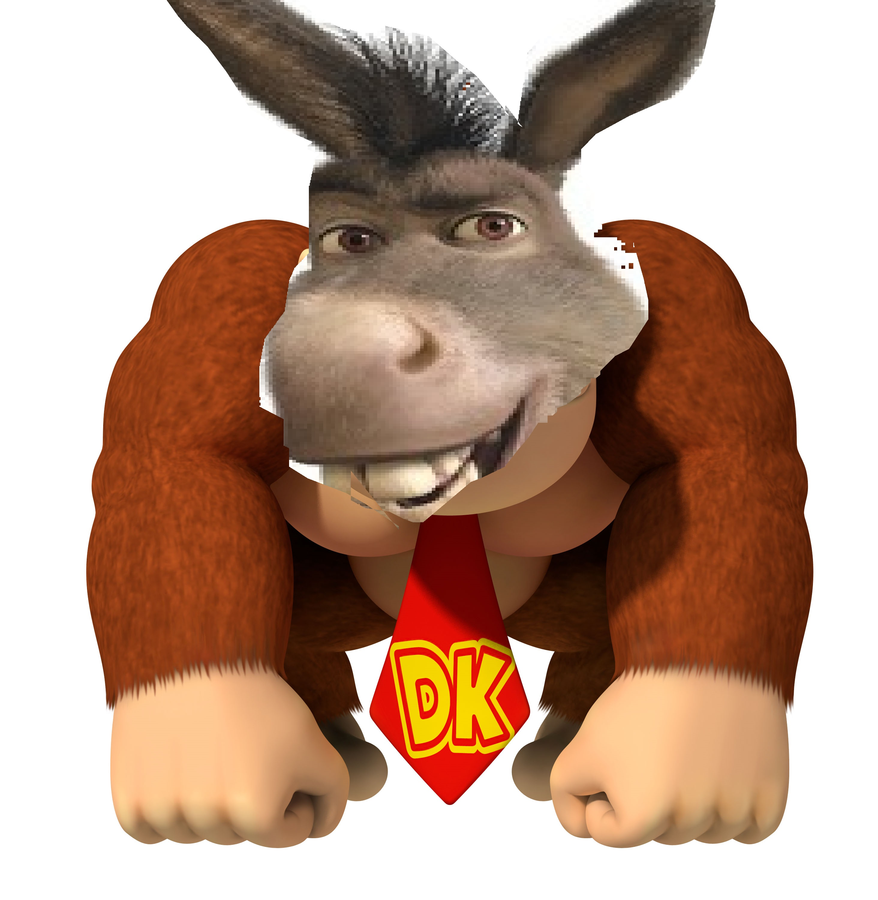

#### this is my projects folder containing all the links to my various projects

|   #    | Folder Link       | Assignment Description                          |
|------- |-------------------|-------------------------------------------------|
| [01](.P01) |  [P01](./P01) | [ Program for our first game code UML](./P01)   |
| [02](.main.cpp) |  [main Code](./main.cpp) | [ main program](./main.cpp)   |
| [03](.Banner) |  [Banner](./Banner) | [ Banner Page](./Banner)   |
| [04](.GameOverPicture.png) |  [GameOver Picture](./GameOverPicture.png) | [ screenshot of gameover](./P01)   |

## Collision Detection

#### Image used to track collision detection

-> for the collision detection i used the ogreshout that fires off from

-> the character and whenever it collides with the flying debris, then

-> the debris detects the interesction, one goes away, one point is added

## Player

#### Picture Texture of the player

-> the player starts the game by holding down the spacebar and in turn this 

-> fires off the ogreshout at the flying debris

-> upon collsion, it calls collision detection

## Debris

#### picture of the debris

-> the flying debris has a texture of the Donkey which position

-> is tracked whenever it moves across the screen

-> collision detection is recorded when player shout intersects with shout
